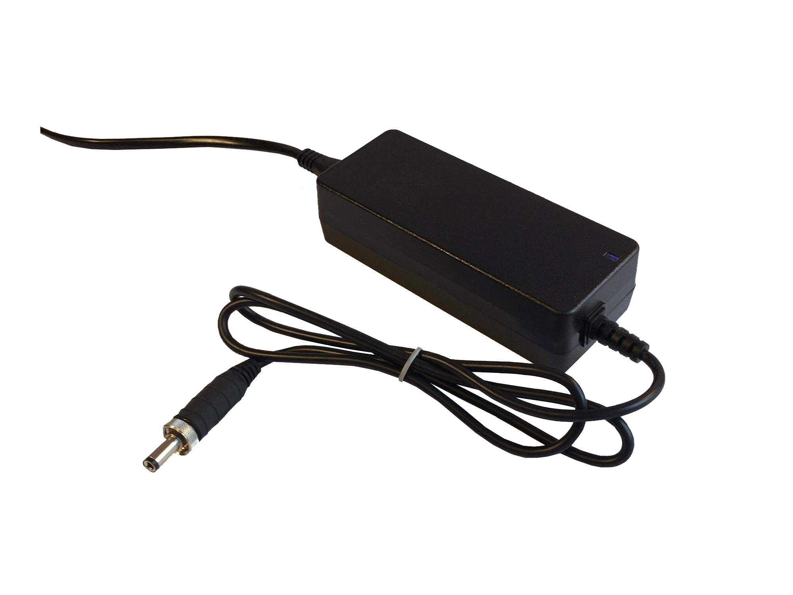
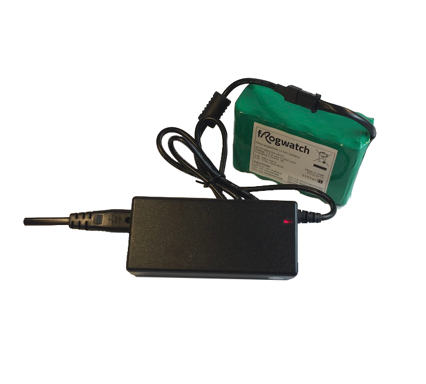

# Frogwatch Meter

## Specificaties

* Afmetingen: 180x123x59mm
* Massa (inclusief batterij): 1200g
* Beschermingsklasse: IP65
* Meetbereik (amplitude): 25000 mm/s^2
* Meetbereik (frequentie): 1-300Hz
* Ruisvloer: 0.06mm/s

Een uitgebreid overzicht van de vind je op de [Frogwatch Facts pagina](https://www.frog.watch/facts/) .

## Externe aansluitingen

De Frogwatch meter is zo ontworpen dat deze op de meetlocatie zo min mogelijk de aandacht trekt van vandalen of nieuwsgierige passanten. Dit is ook de reden dat er aan de buitenkant geen display, knoppen, leds etc zichtbaar zijn. Er zijn slechts twee (optionele) aansluitingen aan de onderkant. De rest is alleen toegankelijk als je het [deksel opent](#deksel).

### DC jack: 12V voeding
Hiermee kan een [12V voedingsadapter](#12v-voedingsadapter) worden aangesloten. Als de meting langer duurt dan de batterijduur, dan is het handig om de 12V voeding aan te sluiten. Hierdoor kun je ongelimiteerd meten zonder batterijen te wisselen. Het is aan te raden om altijd een [battery pack](#battery-pack) aan te sluiten. Hierdoor blijft de meting doorgaan mocht de stroom uitvallen of iemand per ongeluk de stekker eruit trekken. Je kunt via het [Frogwatch Dashboard](../dashboard) zien of de adapter is aangesloten.

### SMA connector: externe antenne

**Belangrijk: Lees eerst de [veiligheidsinformatie](../safety/#sma-connector-externe-antenne)!**

Het kan voorkomen dat er geen of onvoldoende netwerkbereik is op een meetlocatie. Bijvoorbeeld bij ondergrondse metingen of in afgeschermde ruimtes. In deze situaties kan de antenne (die normaal binnenin de Frogwatch Meter zit) via een [verlengkabel](https://www.frog.watch/product/frogwatch-externe-antennekabel/) worden aangesloten:

1. Schroef de antenne en het koppelstukje waarmee deze aan de meter zit los.
2. Koppel de interne kabel aan de binnenkant van de doorvoerconnector
3. Aan de buitenkant van de meter: koppel de verlengkabel aan en sluit hier de antenne weer op aan.
4. Test of de meter binnen enkele minuten na opstarten online komt.

Als de meter langere tijd heeft gemeten zonder netwerkverbinding kan dit wat langer duren, omdat er dan meer data is om uit te wisselen.

## Deksel
Het deksel dient om de meter te beschermen tegen de elementen en geeft de Frogwatch zijn onopvallende look. Het deksel is te openen door de vier boutjes los te draaien. De boutjes blijven aan het deksel vastzitten zodat je ze niet kwijt raakt.

**Let op: het binnenste metalen kastje bevat gevoelige meetinstrumenten en is niet bedoeld om te openen.** Als deze toch geopend wordt, zal een servicebeurt nodig zijn.

Binnen het deksel zie je een metalen kastje met een USB-connector, twee status LEDs en de start/stop knop. Daarnaast uiteraard de mogelijkheid om de batterij aan te sluiten. Ook zie je links de antenne zitten. Deze is los te schroeven zodat je de [antenne kabel kunt verlengen](#sma-connector-externe-antenne).

## Montage
Als je het deksel geopend hebt, zie je dat op elk van de vier hoeken van de meter een uitsparing is met een gat dat helemaal doorloopt, door de aluminium achterkant heen. Deze vier gaten zijn bedoeld om de meter aan de muur te bevestigen.

Gebruik minimaal 2 van de 4 gaten voor een goede bevestiging.

## Aansluiten batterij
De connector van de batterij past maar op één manier op de connector van de Frogwatch. Bij het aansluiten hoor je een lichte klik waardoor je weet dat deze goed vast zit.

Pak altijd de connector zelf vast en trek niet aan de kabels. Er is niet veel kracht nodig om de connector los- en vast te maken: om de batterij los te koppelen druk je op de klikverbinding zodat deze gemakkelijk los komt.

### Standby
Zolang de batterij aangesloten is, zal de Frogwatch periodiek online komen, ook als er geen meting actief is. Dit maakt het mogelijk om metingen op afstand te starten. In deze standby stand gaat het systeem veel langer mee dan tijdens het meten, maar als je de meter volledig uit wilt zetten kun je het beste de batterij loskoppelen.

## Status LEDs

De twee status LEDs zijn bedoeld om tijdens het plaatsen of een snelle inspectie te zien wat de meter aan het doen is. Uitgebreidere informatie is beschikbaar op het [Statusoverzicht op het Frogwatch Dashboard](../dashboard/#statusoverzicht-meters).

Tijdens opstarten:

* **Rode lampje brandt, groen is uit of knippert.**
Dit geeft de eerste ca 5 seconden van het opstarten aan. Bij een firmware update kan dit iets langer duren.
* **Beide lampjes branden.**
De meter is aan het opstarten. Dit duurt maximaal 10 seconden.
* **Beide lampjes knipperen om de beurt.**
De meter is opgestart, maar is nog bezig met gegevens uitwisselen met het Frogwatch Dashboard. De meter haalt de nieuwste instellingen op vanaf de server en stuurt eventuele meetdata van een vorige meting op voordat de meter gestart kan worden.

Na opstarten:

* **Beide lampjes staan uit.**
Dit is normaal. Om stroom te besparen staan ze (behalve tijdens het opstarten) standaard uit. Als je op [de Status / Start / Stop knop](#status-start-stop-knop) drukt laat de Frogwatch gedurende 10 seconden zijn status zien.

* **Na druk op de knop: rode lampje brandt.**
De meting is niet actief, maar de meter is wel klaar voor gebruik.

* **Na druk op de knop: groene lampje brandt.**
De meting is standby: de meting wordt automatisch gestart op het tijdstip dat via het Dashboard is ingesteld.

* **Na druk op de knop: groene lampje knippert.**
De meter is op dit moment aan het meten.

* **Na druk op de knop: rode lampje knippert.**
De meter moet nog worden ingesteld via het Dashboard. Er kan geen meting gestart worden.

* **Na druk op de knop: rode lampje knippert snel.**
Er is een fout opgetreden, de meter is mogelijk defect. Kijk op het Dashboard of er meer informatie beschikbaar is.

## Status / Start / Stop knop
Als de meter is opgestart (lampjes zijn uit), kun je de meter bedienen via de drukknop. Druk eenmaal om de status uit te lezen (de knop even ingedrukt houden tot de lampjes aan gaan).

Druk nogmaals om de meter te starten (indien gestopt) of te stoppen (indien standby of actief).

**Tip**: Als je op de knop drukt terwijl de meter een knipperend rood lampje laat zien (meter niet ingesteld), zal de meter meteen contact maken met het Frogwatch Dashboard om nieuwe instellingen op te halen. Hiermee kun je tijd besparen als je de meter net hebt ingesteld op het Dashboard. Zo hoef je niet te wachten tot de Frogwatch meter zelf contact maakt.

Dit werkt overigens ook als je de meter met de knop start of stopt: de meter maakt dan meteen verbinding om dit door te geven aan het Frogwatch Dashboard.

## USB verbinding

De Frogwatch meter kan [via usb verbonden worden](../usb/) met een computer. Met de Frogwatch software kun je live meekijken op locatie. Dit is vooral handig als moet worden vastgesteld wat de oorzaak van bepaalde trillingen is. Zo kun je observeren dat er zwaar verkeer langsrijdt en meteen de piekwaarde aflezen en het tijdstip noteren.

Meer informatie hierover vind je onder [Frogwatch USB](../usb/).

# Battery Pack

## Specificaties

* Type: Li-ion
* Spanning: 7.2V nominaal
* Capaciteit: 17250 mAh
* Maximum laadstroom: 3A

De battery pack wordt standaard meegeleverd met de Frogwatch meter en is is speciaal ontworpen voor een zo lang mogelijke batterijduur. Gebruik alleen originele Frogwatch batterypacks. Zo weet je zeker dat ze compatible, veilig en van goede kwaliteit zijn. Extra battery packs zijn [verkrijgbaar via de webshop](https://www.frog.watch/product/frogwatch-battery-pack/).

## Aansluiten

De connector past maar op één manier op de connector van de Frogwatch. Bij het aansluiten hoor je een lichte klik waardoor je weet dat deze goed vast zit.

Pak altijd de connector zelf vast en trek niet aan de kabels. Er is niet veel kracht nodig om de connector los- en vast te maken: om de batterij los te koppelen druk je op de klikverbinding zodat deze gemakkelijk los komt.

## Opladen

Er zijn twee manieren om de batterij op te laden:

* ### Via de Frogwatch Meter

De makkelijkste manier is om de batterij aan een Frogwatch meter te verbinden. Door de meter met de bijgeleverde 12V voedingsadapter van stroom te voorzien, zal de batterij worden opgeladen.

* ### Via een Frogwatch Li-ion oplader

De [Li-ion oplader](#li-ion-oplader) is een optionele accessoire die [apart verkrijgbaar](https://www.frog.watch/product/frogwatch-li-ion-oplader/) is via de Frogwatch Webshop. Dit is vooral handig in combinatie met de [los verkrijgbare reserve battery packs](https://www.frog.watch/product/frogwatch-battery-pack/).

Zo kun je bijvoorbeeld een reserve batterij opladen op kantoor zodat je deze op de meetlocatie snel kunt verwisselen met een lege batterij.

## Batterijduur

De batterijdduur is sterk afhankelijk van hoe de Frogwatch meter is ingesteld: hoe meer uren op een dag de meter actief is, des te sneller is de batterij leeg. Tijdens een gemiddeld meetproject is dit ca 14-30 dagen.

Het opladen van de batterij kan tot ca 8 uur duren als deze volledig leeg is. Opladen via de [Frogwatch Meter](#frogwatch-meter) is ongeveer even snel als via de [Li-ion oplader](#li-ion-oplader).

## Beveiliging

De battery packs zijn beveiligd tegen kortsluiting, overbelasting, overcharge en diepontladen. Als een van deze fouten optreed schakelt de battery pack zichzelf uit.

# 12V voedingsadapter

## Specificaties

Deze voedingsadapter is gespecificeerd op 12V 3A. Hiermee heeft de adapter voldoende vermogen om de Frogwatch van stroom te voorzien, zelfs als deze gelijktijdig zijn batterij aan het opladen is.

## Gebruik

De 12V voedingsadapter wordt standaard meegeleverd met de Frogwatch meter en is bedoeld om deze van stroom te voorzien (als dit beschikbaar is op de meetlocatie).
Daarnaast kan de Frogwatch meter automatisch de batterij opladen wanneer de voedingsadapter verbonden is.
Reserve adapters zijn [los verkrijgbaar in de webshop](https://www.frog.watch/product/frogwatch-12v-voedingsadapter/).

De connector is uitgevoerd met een schroefring, waarmee de adapter vastgezet kan worden aan de meter. Hiermee weet je zeker dat de stroomkabel stevig bevestigd is en niet lostrilt.

**Let op:** De standaard meegeleverde voedingsadapter heeft geen IP65 rating en is daarmee alleen bedoeld voor binnengebruik.

**Let op:** De 12V adapter is alleen bedoeld voor gebruik in combinatie met de Frogwatch meter en kan niet op een batterij worden aangesloten. Om losse batterijen op te laden heb je de Frogwatch Li-ion oplader nodig.

# Li-ion oplader

## Specificaties

Deze oplader is speciaal geselecteerd om Frogwatch battery packs op te laden. De laadstroom bedraagt 3A, het duurt ongeveer 5-8 uur om een lege batterij volledig op te laden. De oplader is [verkrijgbaar in de webshop](https://www.frog.watch/product/frogwatch-li-ion-oplader/).

## Aansluiten

De connector past maar op één manier op de connector van de Frogwatch. Bij het aansluiten hoor je een lichte klik waardoor je weet dat deze goed vast zit.

Pak altijd de connector zelf vast en trek niet aan de kabels. Er is niet veel kracht nodig om de connector los- en vast te maken: om de batterij los te koppelen druk je op de klikverbinding zodat deze gemakkelijk los komt.

## Gebruik

Zodra je de oplader aan de batterij koppelt, gaat er een lampje op de lader branden:

* Rood betekent dat de batterij wordt opgeladen.
* Groen betekent dat de batterij vol is.
