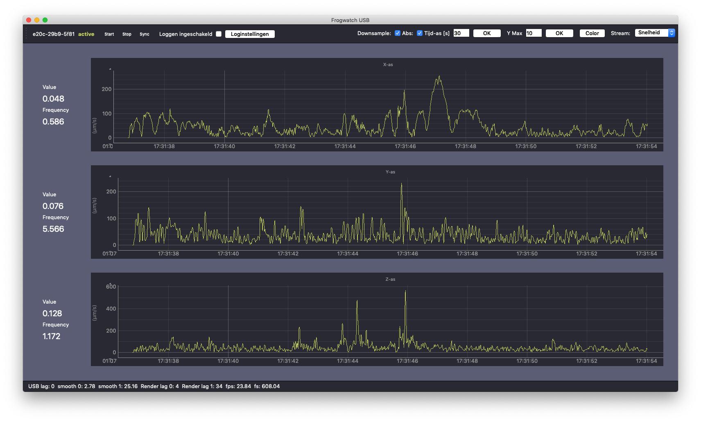
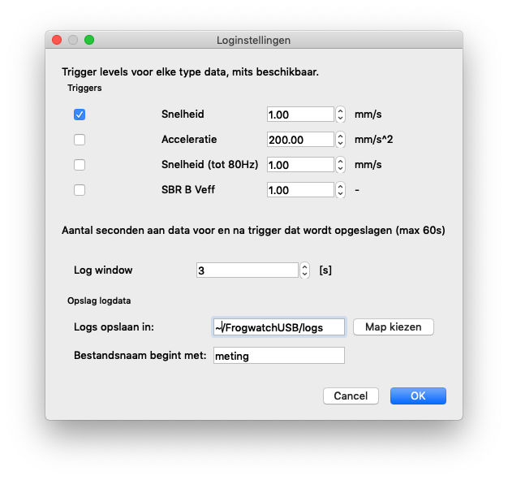

# Realtime inzicht op de meetlocatie

Met de Frogwatch USB software kun je een Frogwatch meter direct op locatie uitlezen. Naast de berekende SBR waardes heb je hiermee realtime inzicht in het volledige gemeten signaal (de zgn 'waveform'). Hiermee kun je snel vaststellen welke trillingen worden veroorzaakt door bijvoorbeeld een passerend voertuig of een andere trillingsbron. Ook is het mogelijk om het gemeten signaal [op te slaan voor latere analyse](#data-loggen) (bijvoorbeeld het berekenen van de FFT rondom bepaalde meetwaarden).

## Installatie

Frogwatch USB is beschikbaar voor Windows en MacOS. De software is te downloaden via de [Frogwatch support pagina](https://dashboard.frog.watch/help).

### Windows

De Windows installatiewizard werkt zoals de meeste installatieprogramma's. Het installatieprogramma heeft beheerdersrechten nodig (er wordt een driver geinstalleerd om met de Frogwatch meter te communiceren). Mocht je geen admin-rechten hebben, vraag dan je IT-beheerder om hiermee te assisteren. 

### MacOS

Op MacOS spreekt de installatie als het goed is voor zich. Omdat je de app niet via de App Store installeert kan het zijn dat je een waarschuwing te zien krijgt.

## Frogwatch USB aansluiten

Als je het Frogwatch programma start, zie je linksboven in beeld de naam van de sensor en de status van de meting.
Zonder aangesloten Frogwatch meter staat hier `no device`.

Sluit de Frogwatch meter aan via een mini-USB kabel. Zodra de meter is opgestart (lampjes zijn uit), dan zal de naam van de meter linksboven in beeld komen te staan (standaard is de naam een serienummer in het formaat `1234-1234-1234`).

### Geen verbinding?
Als er geen meting actief is gaat de Frogwatch meter in een slaapstand om stroom te besparen. Druk even op de knop op de meter om deze 'wakker' te maken. De meter maakt dan meteen verbinding met de computer.

Werkt het niet? Je kunt proberen het programma opnieuw te starten of een andere USB kabel te gebruiken.

## Een meting starten

Je kunt een meting starten/stoppen in het menu bovenaan met de knop `start` en `stop`. Natuurlijk kan dit ook via de [Start / Stop knop](../hardware/#status-start-stop-knop) op de meter zelf.

Zodra je de meting start zal het een paar seconden duren voordat de zelfkalibratie voltooid is en de meetwaarden beschikbaar komen.
Je ziet drie grafieken, van boven naar beneden de `X-as`, `Y-as` en `Z-as`. Links naast de grafiek zie je de bijbehorende SBR waarden. Deze komen overeen met de waarden in het Frogwatch Dashboard. Voor SBR A/C update deze waarde elke seconde, voor SBR B elke 30 seconden.

# Grafiek instellen

Standaard laat de grafiek de absolute waardes zien van de laatste 30 seconden. Bovenaan kun je deze instellingen wijzigen:

* `Downsample`: Het is aan te bevelen om dit aan te laten staan, vooral bij een langer tijdbereik. Downsampling vereenvoudigt de plot waardoor deze soepeler werkt.
* `Abs`: Absolute modus aan/uit. Absolute modus is makkelijker af te lezen: -5mm/s is in absolute zin hoger dan 4mm/s. Als je vooral geinteresseerd bent in de waveform kun je ervoor kiezen om abs uit te vinken.
* `Tijd-as`: Het aantal seconden dat weergegeven wordt in de grafiek. Een korte tijd (bijv. 5 seconden) geeft veel details, maar scrollt ook snel weer uit beeld. Een wat langere tijd geeft meer overzicht maar minder details.
* `Y Max`: Standaard schaalt de y-as van de plot automatisch, hier kun je een vaste waarde instellen.

# Data loggen

Het is mogelijk om automatisch meetdata op te slaan rondom bepaalde piekwaardes. Dit kun je aan/uit zetten met het vinkje `Loggen ingeschakeld`. Per keer dat je een meting start wordt een nieuw bestand opgeslagen. Iedere keer als er een waarde boven het triggerlevel wordt gemeten, wordt de waveform van een aantal seconden voor de piekwaarde tot een aantal seconden erna aan het bestand toegevoegd.

## Instellingen

Klik bovenaan het programma op `Loginstellingen` om de instellingen te openen.

**Let op:** vergeet niet het vinkje `Loggen ingeschakeld` aan te zetten als je klaar bent met instellen. Kun je het instellingen-menu niet openen? Zet dan eerst `Loggen ingeschakeld` uit.

### Triggers

Hier kies je het triggerlevel. Zodra een waarde boven dit niveau wordt gemeten, word er een aantal seconden aan data opgeslagen.
Omdat de Frogwatch meter verschillende types metingen kan doen, moet je voor elke eenheid een trigger level kiezen.
Doe je een SBR-B meting? Dan geldt de waarde `SBR B Veff`.

### Log window

Dit is het aantal seconden voor en na de piekwaarde die word opgeslagen. Stel je dit in op 5 seconden, dan word dus 5 seconden voor de piek t/m 5 seconden na de piek opgeslagen.

### Opslag logdata

Kies een map waar de data word opgeslagen. Per keer dat je een meting start word in deze map een nieuw bestand aangemaakt, die begint met de gekozen naam. In dit bestand komt de meetdata rondom alle piekwaardes hoger dan het ingestelde triggerlevel.

Bijvoorbeeld: je doet een acceleratie meting. Als map kies je `C:\users\mijnnaam\Desktop` en bij `Bestandsnaam begint met` kies je `mijn-meting`. Dan zal er een bestand worden opgeslagen onder `C:\users\mijnnaam\Desktop\mijn-meting-Acceleratie_0.csv` (de volgende meting heet dan `mijn-meting-Acceleratie_1.csv` en zo verder).

### Start logging
**Let op:** vergeet niet het vinkje `Loggen ingeschakeld` aan te zetten als je klaar bent met instellen. Kun je het instellingen-menu niet openen? Zet dan eerst `Loggen ingeschakeld` weer uit.

## Bestandsformaat

Het bestand met meetdata word opgeslagen in CSV-formaat, waardoor het gemakkelijk te importeren is in bijvoorbeeld een spreadsheet.
De eerste kolom is de tijd. Dit is een zgn `unix timestamp` in microseconden. Dit is gedefinieerd als het aantal microseconden sinds 1 januari 1970. Hierdoor is het gemakkelijk om te bepalen wanneer / hoe laat de meting gedaan is.

Daarna volgen drie kolommen met respectievelijk de X-as, Y-as en Z-as.

Aan de bestandsnaam kun je zien wat de eenheid is: acceleratie, snelheid of SBR-B Veff.

